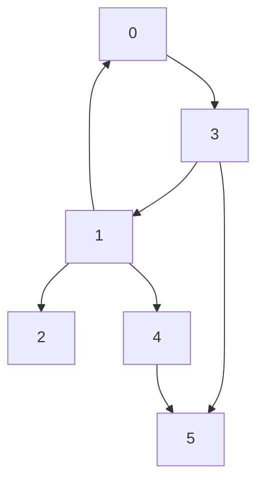
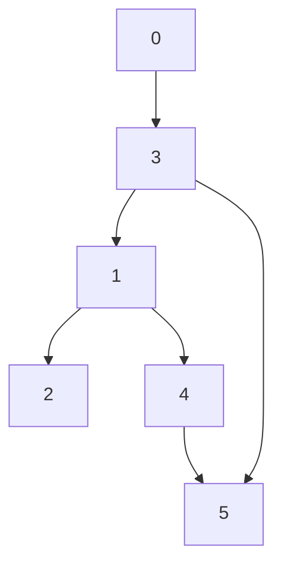

## Cource schedule problem
Given int(n) representing the number of cources. Cources are labled from `0` to `n-1` and array of prerequisites where 
`prerequisite[i] = [a,b]` meening that you need to take cource `b` before `a`.
Task: determine if it is possible to finish all the cources.

```bash
import course_schedule as c
n=6
prereq=[[0,1],[3,0],[1,3],[2,1],[4,1],[4,2],[5,3],[5,4]]
c.cource_schedule(n,prereq)
```
The expected result is `False` becuase there is a circlular dependency 0-3-1-0



```bash
import course_schedule as c
n=6
prereq=[[3,0],[1,3],[2,1],[4,1],[4,2],[5,3],[5,4]]
c.cource_schedule(n,prereq)
```
The expected result is `False` becuase there is no circlular dependencies.
